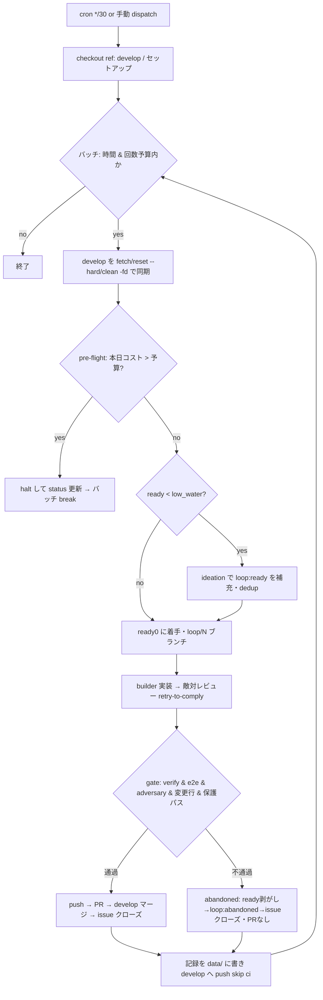

# 自走ループ運用ガイド（Autonomous Loop）

このリポジトリの自己駆動ループ（GitHub Actions 上で「develop から feature を切り、実装 →
敵対レビュー → ゲート → develop マージ」を自走し続ける仕組み）の**アーキテクチャと運用**を
まとめたガイド。2026-07-23 に「**枯れない × 連続 × 予算 $100/日で止まる**」構成へ更新した。

---

## TL;DR

- ループは **GitHub Actions** で回る（ローカルプロセスではない）。トリガーは `cron`（best-effort）＋手動 `workflow_dispatch`。
- 1 起動で **back-to-back に複数周**まわす（連続化）。周回間で develop を綺麗に同期。
- **枯れない**: ready が低水位なら反復先頭で ideation を先回りしてバックログを自動補充。
- **予算 teeth**: 実走前(pre-flight)に本日コストが予算超過なら halt。既定 **$100/日**。
- **本番は main**、ただしループのコードは `checkout ref: develop` で **develop を実行**する（後述）。
- 自動マージは **develop まで**。develop→main の昇格は**人間ゲート**。

---

## アーキテクチャ / データフロー

トリガー → セットアップ → **バッチ（複数周）** → 記録 push。1 周の中身は次のとおり。



**重要な仕組み（誤解しやすい）**
`loop.yml` は `actions/checkout` で **`ref: develop`** を指定し、`python -m orchestrator` を **develop の
チェックアウトから実行**する。したがって:

- orchestrator の**コード**（`orchestrator/loop.py`・`breaker.py`・`__main__.py` など）の変更は
  **develop に merge した時点で実行対象**になる。
- しかし**ワークフロー定義**（`loop.yml` 自体＝バッチ・env・cron・timeout）は **default ブランチ = main**
  から供給される。連続化や `DAILY_COST_BUDGET_USD` の配線を効かせるには **main への昇格が必須**。

---

## 昇格（develop → main）

- **main はランタイムの人間ゲート**。ループの自動マージは develop まで。
- 昇格 = **develop→main の PR を人間がマージ**（`release.yml` が毎週/手動で昇格 PR を自動作成する。マージは人間）。
- main のブランチ保護: 必須チェック `verify`、required reviews 0、enforce_admins False。
- 昇格してはじめて、更新した `loop.yml`（バッチ/予算配線/timeout/cron）が本番に反映される。

> ハマりどころ: `develop` が `main` の過去の昇格マージを取り込んでいないと PR が `BEHIND` で弾かれる。
> `gh pr update-branch <PR>` で base を head に取り込むと解消する。

---

## 運用（repo variables）

`gh variable set <NAME> --body <VALUE>` で調整。ワークフローが env として読む。

| 変数 | 既定 | 意味 |
|---|---|---|
| `LOOP_ENABLED` | `true` | `false` でジョブ自体を実行しない（キルスイッチ L2） |
| `DAILY_COST_BUDGET_USD` | `100` | 本日コストがこれを超えたら pre-flight で halt（実効キャップ） |
| `LOOP_BATCH_SECONDS` | `3000` | この秒数を超えたら新しい周を始めない（連続の濃さ・既定 50 分） |
| `LOOP_BATCH_MAX` | `20` | 1 起動あたり最大周回数（時間予算が先に効くことが多い） |
| `LOOP_ITER_TIMEOUT` | `3600` | 1 周のハング保護（この秒数で強制終了） |
| `ORCHESTRATOR` | `native` | `native` / `h5i` |
| `BUILDER_MODEL` | `claude-sonnet-5` | 実装エージェント |
| `ADVERSARY_MODEL` | `claude-haiku-4-5` | 敵対レビュー |
| `IDEATION_MODEL` | `claude-haiku-4-5` | 次 issue 生成（給油） |

> `timeout-minutes: 350` はジョブの安全上限。実周回数は上の `LOOP_BATCH_*` 予算で決まる。

---

## 停止・調整レバー

```bash
# 止める
gh variable set LOOP_ENABLED false        # 次の起動を止める（最も確実）
gh run cancel <run-id>                     # 今動いているバッチを即キャンセル
gh workflow disable loop.yml               # cron 完全停止

# 予算・連続の濃さ
gh variable set DAILY_COST_BUDGET_USD 20   # 上限を下げる
gh variable set LOOP_BATCH_SECONDS 18000   # もっとガンガン（1 起動最大 ~5h）
gh variable set LOOP_BATCH_MAX 100         # 周回数上限を上げる

# 手動起動
gh workflow run loop.yml                    # 通常（マージまで）
gh workflow run loop.yml -f dry_run=true    # PR 作成までで停止（マージしない）
```

---

## ゲートとブレーカ

**ゲート**（[`orchestrator/gates.py`](../orchestrator/gates.py) `evaluate_gate`）— 全部通ったときだけ push/PR/merge:
- `verify`（単体）合格 / `e2e` 合格 / `adversary` が approve
- 変更行数 ≤ `max_changed_lines`（既定 3000）
- **保護パスに触れない**: `PROTECTED_PREFIXES = .github/workflows/ , orchestrator/ , .loop/ , tests/`
  → ループは**自分のハーネス（CI・オーケストレータ・テスト）を書き換えられない**。実質 `dashboard/` と `data/`・`docs/` 等のみ。

不通過は人間に振らず **abandoned**（自動見送り: ready 剥がし → `loop:abandoned` → issue クローズ、PR は作らない）。
builder は gate を満たすまで `max_revise_cycles`（既定 3）まで再試行（retry-to-comply）。

**ブレーカ**（[`orchestrator/breaker.py`](../orchestrator/breaker.py)）:
- `consecutive-failures`: 直近 `circuit_breaker_fails`（既定 3）反復が連続でマージに至らない → halt（**実走後**判定）。
- `daily-budget`: 本日コスト > `DAILY_COST_BUDGET_USD` → halt。
  - **pre-flight**（`preflight_budget_halt`）で**実走前**にも判定 → 高価な builder を起動せず止める（連続運転のオーバーシュート防止）。
  - halt すると `loop:halted` issue を立て status を HALTED にする。再開は `gh variable set LOOP_ENABLED true`。

---

## ラベル

| ラベル | 意味 |
|---|---|
| `loop:ready` | ループが着手してよい（＝燃料）。picker はこれの付いた open issue のみ拾う |
| `loop:abandoned` | gate を再試行しても満たせず自動見送りした |
| `loop:halted` | ブレーカ作動の通知（作業対象ではない） |
| `loop:paused` | キルスイッチでマージ直前に中断 |
| `loop:needs-human` | 旧方式の名残（現行は発行しない） |

> 手でネタを足すには `loop:ready` 付きで issue を立てる。ただし自己給油があるので、通常は放っておいても
> ideation が補充する。

---

## コスト目安

- 1 周 ≒ builder **$6.5**（sonnet で機能実装した場合）。
- **連続で回すほど課金は増える**。実効キャップは `DAILY_COST_BUDGET_USD`（既定 $100/日）で pre-flight halt。

---

## 既知の弱点 / 今後

- **cron の間引き**: GitHub の `schedule` は best-effort で実測 70〜100 分/回・数時間の穴あり。ギャップを
  完全に消すには **PAT による self-chaining**（`GITHUB_TOKEN` では再トリガー不可）か**外部トリガー**が要る。
- **consecutive-failures は post-hoc のみ**（pre-flight 化していない）。実害は予算 teeth が上限で受け止める。
- **coveragePct は本番では 0.0**（未計測）。カバレッジ計測は別イシュー。

---

## 設計・変更履歴（参照）

- 自己給油（枯れない化）: [`docs/superpowers/specs/2026-07-23-loop-self-refuel-design.md`](superpowers/specs/2026-07-23-loop-self-refuel-design.md) / PR #34
- 連続実行バッチ化: PR #35
- 予算 teeth（pre-flight・$100/日）: PR #40
- 全自動化（needs-human 廃止 → retry-to-comply + abandoned）: [`docs/superpowers/specs/2026-07-22-autonomous-retry-to-comply-design.md`](superpowers/specs/2026-07-22-autonomous-retry-to-comply-design.md) / PR #21
- main 昇格: PR #41
