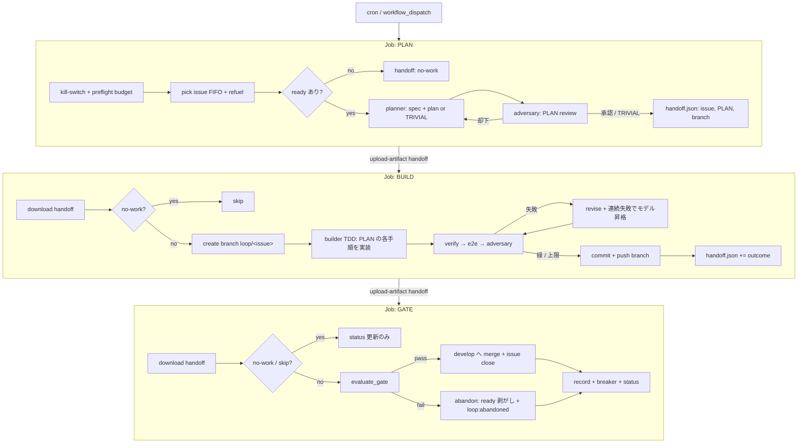

# superpowers 準拠・ブックエンド分割パイプライン 設計

- 日付: 2026-07-24
- 状態: 設計合意待ち（レビュー用）
- 関連: [self-driving-loop](2026-07-20-self-driving-loop-design.md) / [retry-to-comply](2026-07-22-autonomous-retry-to-comply-design.md) / [self-refuel](2026-07-23-loop-self-refuel-design.md)

## 1. 目的

自走ループの実装エージェントを、いまのフラットな「実装して」1発プロンプトから、
**superpowers の開発規律（spec → plan → TDD → review）をネイティブ移植した多フェーズ
パイプライン**に置き換える。第一の狙いは **大きな/構造的な機能（例: #176 複数ページ化）を
abandon させず確実に完遂すること**。

失敗の最大要因は「実装してから verify/e2e/adversary で初めて筋の悪さが露見し、revise 3 回では
直しきれない」こと。→ **コードを書く前（計画段階）に筋を検証**し、**難所ではモデルを昇格**する。

## 2. 確定した設計判断（ブレインストーミングの結論）

| 論点 | 決定 |
|---|---|
| 主目的 | 大きな機能を確実に完遂（計画フェーズ＋モデル昇格） |
| superpowers の入れ方 | **ネイティブ移植**（スキル内容をプロンプト源泉に流用・自律動作へ翻案。プラグイン非依存） |
| フェーズ分離の粒度 | **ブックエンド分割**（PLAN ジョブ → BUILD ジョブ → GATE ジョブ、CI で連結） |
| 計画の適用 | 常時＋**自己トリアージ**（planner が trivial を即返す。分類器は足さない） |
| PLAN レビュー | あり（build 前に adversary が PLAN を審査） |
| モデル昇格 | revise が `escalate_after_cycles` に達したら builder を上位モデルへ |
| PLAN の保存 | run 記録に PLAN テキストを格納（repo には commit しない） |
| バッチ | 1 反復 = 1 workflow run（3 ジョブ）。スループットは cron 頻度で確保（後述） |

## 3. なぜ「巡回の内側」は分割しないか（設計の肝）

ループ中核 `build ↔ verify ↔ e2e ↔ review ↔ revise` は
- **状態 = git 作業ツリー**（builder の未コミット差分）
- **サイクリック**（revise で戻る。Actions の `needs` DAG は非巡回）

を持つため、この内側をジョブ分割すると「dirty tree の artifact 化・再適用」「`workflow_run` 再ディスパッチ
（1 サイクルごとに runner 起動＋`npm ci` 数分）」「判断ロジックが YAML に流出し pytest 不能」という
コストが出る。→ **巡回の内側は 1 ジョブ（BUILD）に閉じ込め、非巡回の前後（PLAN / GATE）だけを分割**する。

これにより **オーケストレーション判断は Python のまま（テスト可能・develop チェックアウトで反映＝main
昇格不要）**、YAML はジョブ連結と handoff artifact の移動だけを担う。

## 4. アーキテクチャ



### 状態の運搬
- **コード変更 = git ブランチ**: BUILD が `loop/<issue>-<slug>` に commit & push。GATE がその PR/ブランチを
  develop へ merge する（git が唯一の変更運搬路）。
- **メタデータ = handoff artifact**: `data/handoff/iteration.json`（issue 番号・title・branch・PLAN テキスト・
  trivial フラグ・build outcome）を `upload-artifact`/`download-artifact` で PLAN→BUILD→GATE に受け渡す。

## 5. フェーズ仕様

### PLAN ジョブ（前ブックエンド）
- 入力: なし（リポジトリ状態）
- 処理:
  1. kill-switch / preflight budget（現行 `__main__` の先頭ロジックを流用）
  2. `pick issue`（FIFO・実装済み）＋ `refuel`（低水位補充・実装済み）
  3. ready 無し → handoff に `status=no-work` を書いて終了（BUILD/GATE は skip）
  4. **planner**（新エージェント）: issue を入力に **設計 + ファイル単位タスク分解 + 検証可能な受入条件**を出力。
     小さい issue には `TRIVIAL`（計画不要）を即返す自己トリアージ。
  5. **plan-review**（adversary 流用）: PLAN が issue を満たす筋か審査。却下なら planner に戻す（最大 `max_plan_cycles`）。
- 出力: `handoff.json`（issue, branch 名, PLAN, trivial, status=ok）

### BUILD ジョブ（巡回の中核・分割しない）
- 入力: `handoff.json`
- 処理: `create_branch` → **builder（TDD 規律で PLAN の各手順を実装）** → `verify → e2e → adversary` の
  retry-to-comply ループ（現行 `run_native_round` を v2 化）。**revise が `escalate_after_cycles` に達したら
  builder を `builder_escalation_model` へ昇格**。緑 or 上限で commit & push。
- 出力: `handoff.json += outcome`（verify/e2e/adversary/revise_cycles/使用モデル/cost/changed_lines）

### GATE ジョブ（後ブックエンド）
- 入力: `handoff.json`（outcome 込み）
- 処理: `evaluate_gate`（純関数・実装済み）→ pass なら develop へ merge + issue close、fail なら abandon。
  その後 `record`（PLAN テキストも格納）＋ `breaker` ＋ `status` 更新（現行 `__main__` 後半を流用）。
- 出力: run 記録・status。

## 6. 新規/変更エージェント

- **planner（新規）**: `orchestrator/plan.py`。プロンプトは superpowers の *brainstorming*（設計の分解）と
  *writing-plans*（手順化・受入条件）の**内容を源泉に、人間 Q&A 無しの自律版に翻案**。
  出力は JSON（`{ "trivial": bool, "design": str, "tasks": [...], "acceptance": [...] }`）。
- **plan-review**: 既存 adversary（公正レビュー）を PLAN 用プロンプトで再利用。
- **builder（改）**: プロンプトに superpowers *test-driven-development* の規律（テスト先行・最小実装・
  見せかけ禁止）を明示注入。PLAN を受けて手順を実装。陳腐化した「3000 行以内」記述を除去。
- **モデル昇格（新規）**: `run_native_round` v2 が cycle 数に応じて使用モデルを切替。

## 7. Config 追加（`orchestrator/config.py`）

```python
planner_model: str = "claude-sonnet-5"
builder_escalation_model: str = "claude-opus-4-8"
escalate_after_cycles: int = 2      # revise がこの回数に達したら昇格
max_plan_cycles: int = 2            # plan-review 却下からの再計画上限
```
すべて `from_env` フォールバック付き（`PLANNER_MODEL` 等）。

## 8. CLI サブコマンド（`orchestrator/__main__.py`）

`python -m orchestrator {plan|build|gate}` の 3 エントリに分解。各ジョブが 1 つを呼ぶ。
現行の一括 `run_iteration` は `plan_phase` / `build_phase` / `gate_phase` に分割し、各々を fake で単体テスト。
handoff の読み書きは `orchestrator/handoff.py`（新規・純 I/O）に集約。

## 9. スループット（バッチの扱い）

現行は 1 run で反復を連続バッチ（in-process ループ）。ブックエンド化で **1 反復 = 1 run（3 ジョブ）** になる。
- v1 は **cron 頻度で確保**（必要なら `*/30 → */15` に短縮）。品質優先の今回、日次マージ数は十分。
- 自己再ディスパッチ（run 末に次の run を起動）は GITHUB_TOKEN では発火しない（再帰防止）ため PAT が要る。
  **v1 では入れない**（YAGNI）。将来オプションとして残す。

## 10. テスト戦略（TDD）

- `plan_phase` / `build_phase` / `gate_phase` を FakeGh・fake runner で単体テスト（既存の仕組みを流用）。
- planner の出力 JSON パース、trivial 分岐、plan-review 却下→再計画、モデル昇格（cycle 閾値で model が切替わる）、
  handoff の round-trip を各々テスト。
- YAML の連結は最小（job の `needs`＋artifact）。ロジックは Python 側に寄せてテストで守る。

## 11. superpowers 内容 → プロンプト源泉の対応

| superpowers skill | 使う先 |
|---|---|
| brainstorming（設計分解の型） | planner の設計パート（自律版） |
| writing-plans（手順化・受入条件） | planner のタスク/受入パート |
| test-driven-development（規律） | builder プロンプト |
| requesting/receiving-code-review | adversary（diff & PLAN レビュー） |
| verification-before-completion | verify/e2e ゲート（既存） |
| finishing-a-development-branch | GATE の PR→develop merge（既存） |

## 12. スコープ / YAGNI（v1 で入れない）

- worktree / 並列サブエージェント / systematic-debugging の独立エージェント化 → 入れない（revise＋昇格で代替）。
- 自己再ディスパッチ（PAT）→ 入れない。
- 巡回内側のジョブ分割 → 入れない（§3 の理由）。

## 13. 段階移行（ライブ稼働を止めない）

ループは LIVE（数分ごとに merge 中）。一気に差し替えない。

1. **Phase A（orchestrator 内・develop マージのみで安全）**: planner/handoff/昇格/`plan|build|gate` サブコマンドを
   TDD で実装しマージ。**現行 loop.yml は従来 entry を呼び続けるので稼働に影響なし**。
2. **Phase B（新 workflow を並走）**: `loop-v2.yml`（PLAN→BUILD→GATE の 3 ジョブ）を追加。`workflow_dispatch`
   で手動検証（緑を確認）。cron はまだ従来 loop.yml。
3. **Phase C（切替）**: v2 が安定したら cron を loop.yml → loop-v2.yml に移す（**この YAML 変更のみ main 昇格が必要**）。
   問題あれば cron を戻すだけでロールバック。

## 14. リスク / トレードオフ

- **1 反復が長くなる**（planner + plan-review 追加）＝ run あたり反復数は減る。cost は Max/OAuth で実質ゼロだが
  時間は増える。→ 大機能の確実性と引き換えで妥当。
- **ジョブ間で `npm ci` 再実行**（BUILD/GATE が別 runner）。→ 公開リポジトリで minutes 無料、許容。
- **workflow YAML 変更は main 昇格が必要**（Phase C）。ロジックは orchestrator 側なので頻繁な調整は develop で完結。
- **trivial 誤判定**（planner が大機能を trivial と誤る）→ plan-review が拾う設計。閾値はプロンプトで調整。
